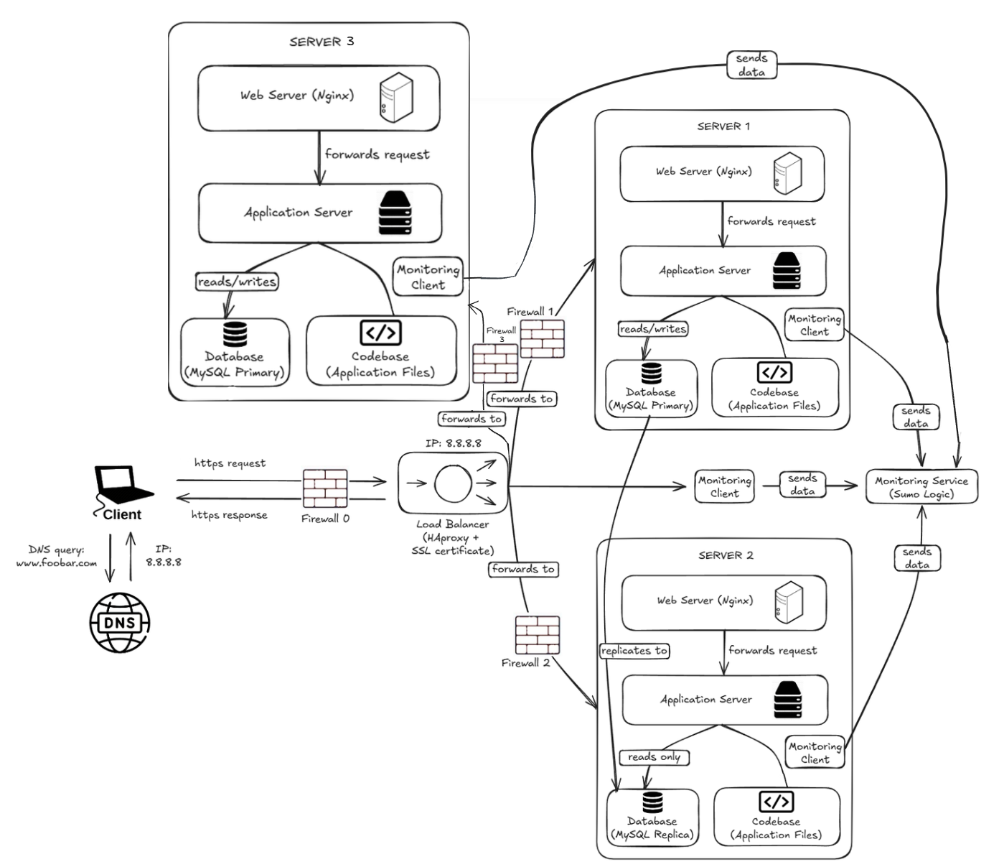

---

EXPLANATIONS

Why each additional element:
- Firewall 0: filters incoming traffic before it reaches the load balancer, blocking unauthorized or malicious requests.
- Firewall 1 and 2: filter traffic before it reaches each server, adding a second layer of protection.
- SSL certificate: encrypts traffic between the user and the load balancer so data cannot be intercepted.
- Monitoring clients: collect metrics and logs from the load balancer and each server and send them to the monitoring service.

What firewalls are for:
- A firewall filters network traffic based on rules, blocking unauthorized access and protecting the infrastructure from attacks.

Why traffic is served over HTTPS:
- HTTPS encrypts the traffic between the user and the server, preventing attackers from intercepting or tampering with the data.

What monitoring is used for:
- Monitoring tracks the health, performance, and availability of the infrastructure in real time, and alerts when something goes wrong.

How the monitoring tool collects data:
- A monitoring client runs on each server and on the load balancer. It collects metrics (CPU, memory, requests, errors) and logs, then sends them to the monitoring service (Sumo Logic).

How to monitor web server QPS:
- Configure the monitoring client to collect the request count metric from Nginx logs. QPS (Queries Per Second) is calculated by dividing the number of requests by the time interval. Set up a dashboard or alert in Sumo Logic based on this metric.

---

ISSUES

Terminating SSL at the load balancer level:
- Traffic between the load balancer and the servers is unencrypted. If an attacker gains access to the internal network, they can intercept the data.

Only one MySQL server capable of accepting writes:
- The Primary database is a SPOF for all write operations. If it goes down, no data can be written until it is restored.

All servers having the same components:
- Running a database, web server, and application server on every machine wastes resources and makes the infrastructure harder to scale and maintain. A failure or misconfiguration on one component can affect all others on the same server.
