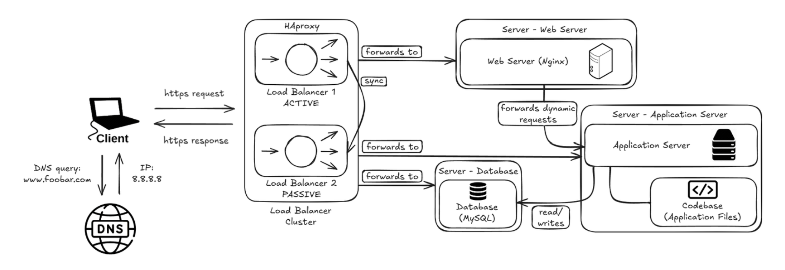

---

EXPLANATIONS

Why each additional element:
- Second load balancer (HAproxy cluster): the two load balancers are configured as a cluster (active/passive). If the active one fails, the passive one takes over automatically, eliminating the load balancer as a SPOF.
- Dedicated web server: isolates Nginx on its own machine so it can be scaled, maintained, and debugged independently without affecting the application or database.
- Dedicated application server: isolates the application logic on its own machine, allowing independent scaling and avoiding resource conflicts with the web server or database.
- Dedicated database server: isolates MySQL on its own machine, giving it dedicated resources (CPU, RAM, disk I/O) and improving security by limiting direct access to the data.
