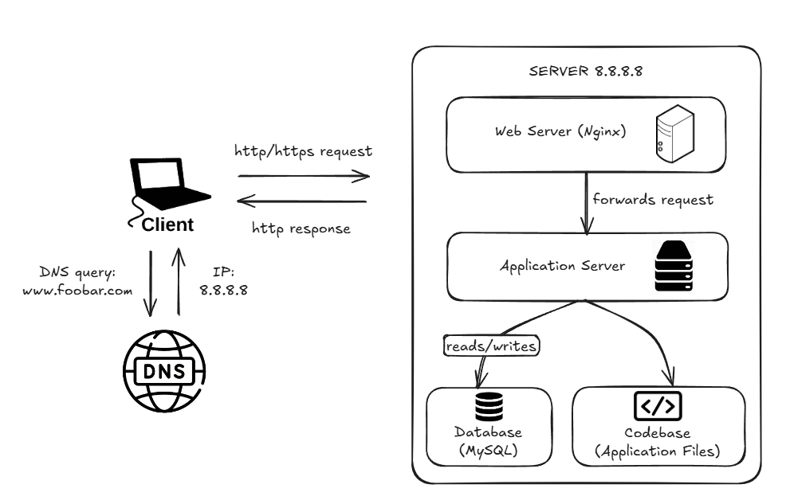
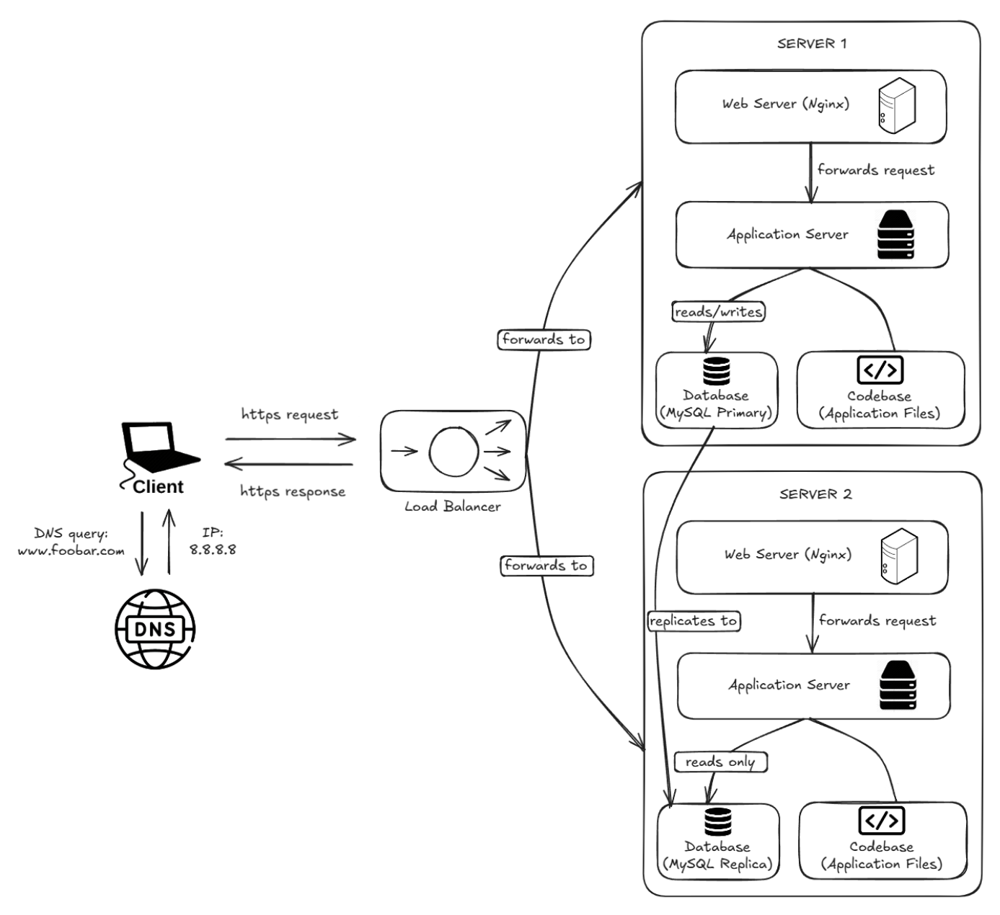
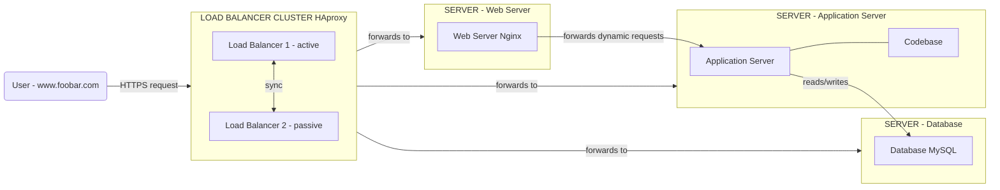

# Web Infrastructure Design

This project covers the design and understanding of web infrastructures, from a simple single-server setup to a secured, monitored, and scalable distributed architecture.

Each task requires designing an infrastructure on a whiteboard, explaining every component and its role, and identifying the weaknesses of the design.

---

## Tasks & Diagrams

### 0. Simple Web Stack
A basic infrastructure hosting `www.foobar.com` on a single server.
Components: Nginx, application server, codebase, MySQL database.
Key concepts: SPOF, DNS A record, TCP/IP communication.

### 1. Distributed Web Infrastructure
A three-server infrastructure with a load balancer (HAproxy).
Components: 2 servers (Nginx + app server + codebase + MySQL), HAproxy with Round Robin.
Key concepts: Active-Active setup, Primary-Replica database cluster, redundancy.

### 2. Secured and Monitored Web Infrastructure
The distributed infrastructure secured and monitored.
Components: 3 firewalls, 1 SSL certificate, 3 monitoring clients (Sumo Logic).
Key concepts: HTTPS, firewall, QPS monitoring, SSL termination issue.

### 3. Scale Up
A fully split infrastructure with dedicated servers per component.
Components: 1 additional server, HAproxy cluster (active/passive), dedicated web server, application server, and database server.
Key concepts: elimination of SPOF at load balancer level, component isolation.

---

## Acronyms to know

| Acronym | Stands for |
|--------|------------|
| DNS | Domain Name System |
| HTTP | HyperText Transfer Protocol |
| HTTPS | HyperText Transfer Protocol Secure |
| SSL | Secure Sockets Layer |
| TCP/IP | Transmission Control Protocol / Internet Protocol |
| SPOF | Single Point of Failure |
| LAMP | Linux, Apache, MySQL, PHP |
| QPS | Queries Per Second |
| IP | Internet Protocol |
| URL | Uniform Resource Locator |

---

## Repository

- GitHub repository: `holbertonschool-system_engineering-devops`
- Directory: `web_infrastructure_design`
